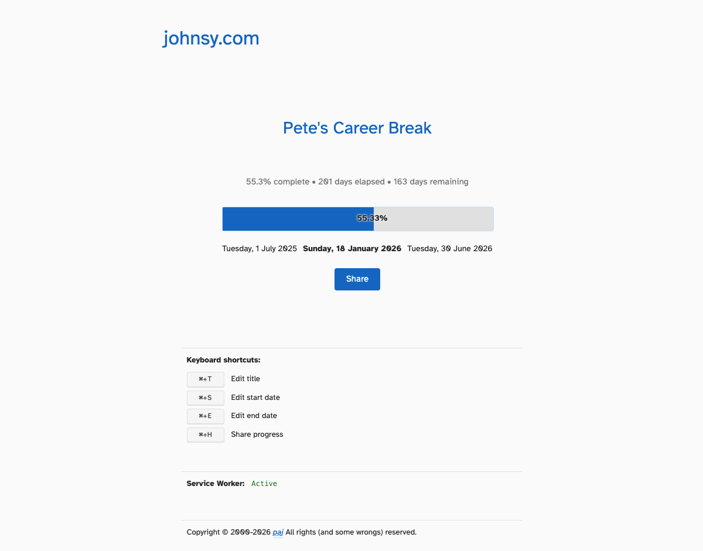

# Progress

A microsite for www.johnsy.com that displays a progress bar based on two dates from the URL path.

## Usage

The site takes two dates from the URL path, with an optional title:

```
/progression/2024-01-01/2024-12-31
/progression/2024-01-01/2024-12-31/Pete's Career break
```

- The left end of the progress bar represents the earlier of the two dates
- The right end represents the later of the two dates
- If today is within the range, it will be shown with the percentage complete
- The percentage is clamped between 0% and 100%
- An optional third parameter can be used as a custom title (defaults to "Progress")
- If no valid dates are provided, the site automatically redirects to the current year (e.g., `/progression/2025-01-01/2025-12-31/2025`)

### Editing Features

All elements of the progress bar can be edited directly:

- **Title** - Click the title or press `Alt+T` (or `Cmd+T` on Mac) to edit. Press `Enter` to save or `Escape` to cancel.
- **Start Date** - Click the start date or press `Alt+S` (or `Cmd+S` on Mac) to open a date picker. The start date is constrained to dates in the past (up to today).
- **End Date** - Click the end date or press `Alt+E` (or `Cmd+E` on Mac) to open a date picker. The end date is constrained to dates from today onwards.

When dates are changed, the URL is automatically updated and the progress bar is recalculated. If the start date becomes after the end date (or vice versa), the other date is automatically adjusted to maintain a valid range.

### Appearance

The site supports both light and dark modes, automatically adapting to your system preferences. The color palette matches www.johnsy.com's design system.



## Development

```bash
# Install dependencies
pnpm install

# Build
pnpm run build

# Run tests (watch mode)
pnpm test

# Run tests once
pnpm run test:run

# Start development server
pnpm dev

# Note: Service worker functionality is not available in dev mode.
# To test service worker features (e.g., OpenGraph image generation),
# use `pnpm run build && pnpm run preview` instead.

# Format code
pnpm run format

# Lint code
pnpm run lint

# Type check
pnpm run typecheck

# Run all checks (format, lint, typecheck, test)
pnpm run precommit
```

## Project Structure

- `src/main.ts` - Entry point, initialises the progress bar and handles URL redirects
- `src/progressBar.ts` - Progress bar logic and rendering
- `src/utils/dateParser.ts` - Date parsing and progress calculation utilities
- `src/utils/svgGenerator.ts` - SVG generation for OpenGraph images
- `src/utils/generateFallbackSVG.ts` - Static fallback SVG generation
- `src/sw.ts` - Service worker for dynamic SVG generation
- `src/server/htmlTransform.ts` - Vite plugin for HTML transformation during development
- `src/server/buildPlugin.ts` - Vite plugin for build-time optimisations
- `src/index.html` - HTML template
- `src/style.css` - Styles matching www.johnsy.com (supports light and dark modes)
- `src/utils/share.ts` - Share functionality using Web Share API or clipboard fallback

## Building

The project compiles TypeScript to JavaScript in the `dist/` directory. The HTML and CSS files are copied to `dist/` during the build process.

```bash
# Build for production
pnpm run build

# Preview production build
pnpm run preview
```

## Deployment

The project is configured to deploy to GitHub Pages automatically via GitHub Actions.

### CI Workflow

The CI workflow runs on:
- Pull requests
- Pushes to any branch

It runs tests, linting, type checking, and builds the project to ensure code quality.

### Deploy Workflow

The deploy workflow:
- Runs automatically when CI completes successfully on the `main` branch
- Can be manually triggered via GitHub Actions UI
- Deploys to GitHub Pages only after all checks pass

### Setting up GitHub Pages

1. Go to your repository Settings → Pages
2. Under "Source", select "GitHub Actions"
3. Push to the `main` branch to trigger CI, which will then trigger deployment

The site will be available at `https://yourusername.github.io/progression` (replace `yourusername` and `progression` with your actual GitHub username and repository name).

### Dependabot

Dependabot is configured to automatically create PRs for dependency updates. PRs that pass CI will be automatically merged.

## Testing

Unit tests are written using Vitest and cover:
- Date parsing from URL paths (including base path handling)
- Title parsing from URL paths
- Progress calculation
- Edge cases (dates outside range, invalid dates, etc.)
- Default behavior when no dates provided

Run tests with `pnpm run test:run` (single run) or `pnpm test` (watch mode).


