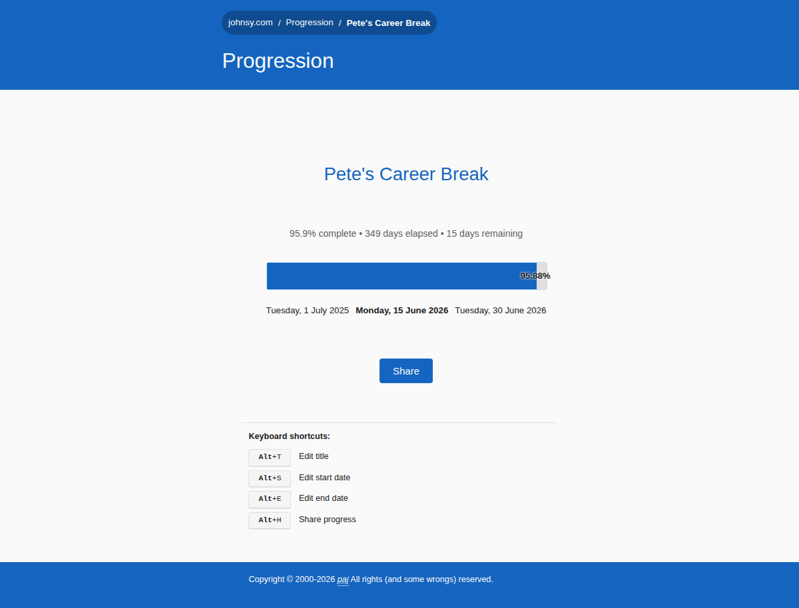

# Progress

A microsite for www.johnsy.com that displays a progress bar based on two dates from the URL path.

## Usage

The site takes two dates from the URL path, with an optional title:

```
/progression/2024-01-01/2024-12-31
/progression/2024-01-01/2024-12-31/Pete's Career break
```

- The left end of the progress bar represents the earlier of the two dates
- The right end represents the later of the two dates
- If today is within the range, it will be shown with the percentage complete
- The percentage is clamped between 0% and 100%
- An optional third parameter can be used as a custom title (defaults to "Progress")
- If no valid dates are provided, the site automatically redirects to the current year (e.g., `/progression/2025-01-01/2025-12-31/2025`)

### Editing Features

All elements of the progress bar can be edited directly:

- **Title** - Click the title or press `Alt+T` (or `Cmd+T` on Mac) to edit. Press `Enter` to save or `Escape` to cancel.
- **Start Date** - Click the start date or press `Alt+S` (or `Cmd+S` on Mac) to open a date picker. The start date is constrained to dates in the past (up to today).
- **End Date** - Click the end date or press `Alt+E` (or `Cmd+E` on Mac) to open a date picker. The end date is constrained to dates from today onwards.
- **Share** - Press `Alt+H` (or `Cmd+H` on Mac) to share the progress bar. Uses the Web Share API if available, otherwise falls back to copying the link to clipboard.

When dates are changed, the URL is automatically updated and the progress bar is recalculated. If the start date becomes after the end date (or vice versa), the other date is automatically adjusted to maintain a valid range.

### Sharing

The progress bar can be shared using the Web Share API (on supported platforms) or by copying the link to the clipboard. When sharing with the Web Share API, a PNG screenshot of the progress bar (excluding the Share button) is captured and included.

### Appearance

The site supports both light and dark modes, automatically adapting to your system preferences. The color palette matches www.johnsy.com's design system.



## Development

```bash
# Install dependencies
pnpm install

# Build
pnpm run build

# Run tests (watch mode)
pnpm test

# Run tests once
pnpm run test:run

# Start development server
pnpm dev

# Format code
pnpm run format

# Lint code
pnpm run lint

# Type check
pnpm run typecheck

# Run all checks (format, lint, typecheck, test)
pnpm run precommit

# Run Lighthouse (performance, accessibility, best-practices, SEO)
# Build first, then run. Set BASE_URL to match your deploy path if needed.
pnpm run build && pnpm run lighthouse

# Regenerate README/OG screenshot (preview server must be running)
pnpm run build && pnpm run preview &
sleep 5 && pnpm run generate:screenshot

# Regenerate PWA/app icons (PNG from assets/icon.svg)
pnpm run generate:icons
```

## Project Structure

- `src/main.ts` - Entry point, initialises the progress bar and handles URL redirects
- `src/progressBar.ts` - Progress bar logic and rendering
- `src/utils/dateParser.ts` - Date parsing and progress calculation utilities
- `src/utils/progressStatus.ts` - Status text and date calculations for the progress bar
- `src/server/htmlTransform.ts` - Vite plugin for HTML transformation during development
- `src/server/buildPlugin.ts` - Vite plugin for build-time optimisations
- `src/index.html` - HTML template
- `src/style.css` - Styles matching www.johnsy.com (supports light and dark modes)
- `src/utils/share.ts` - Share functionality: captures progress bar as PNG (excluding Share button) and uses Web Share API or clipboard fallback
- `src/utils/generateSitemap.ts` - Sitemap generation utility
- `src/utils/escapeXml.ts` - XML/HTML escaping utility

## Building

The project compiles TypeScript to JavaScript in the `dist/` directory. The HTML and CSS files are copied to `dist/` during the build process.

```bash
# Build for production
pnpm run build

# Preview production build
pnpm run preview
```

## Deployment

The project is configured to deploy to GitHub Pages automatically via GitHub Actions.

### CI Workflow

The CI workflow runs on:

- Pull requests
- Pushes to any branch

It runs tests, linting, type checking, and builds the project. If the generated screenshot differs from `assets/screenshot.png`, the screenshot job emits a workflow warning so you can regenerate and commit locally (or merge the automated screenshot PR from the **Screenshot Auto Update** workflow).

### Deploy Workflow

The deploy workflow:

- Runs automatically when CI completes successfully on the `main` branch
- Can be manually triggered via GitHub Actions UI
- Deploys to GitHub Pages only after all checks pass

### Setting up GitHub Pages

1. Go to your repository Settings → Pages
2. Under "Source", select "GitHub Actions"
3. Push to the `main` branch to trigger CI, which will then trigger deployment

The site will be available at `https://yourusername.github.io/progression` (replace `yourusername` and `progression` with your actual GitHub username and repository name).

### Dependabot

Dependabot is configured to automatically create PRs for dependency updates. PRs that pass CI are queued for auto-merge using a merge commit (not squash).

### Automatic Screenshot Updates

Screenshot updates are automated via the **Screenshot Auto Update** workflow (`.github/workflows/screenshot-auto-update.yml`):

- On each push to `main` (and on a daily schedule), CI builds the site, starts preview, regenerates `assets/screenshot.png`, and opens a PR when the image changed
- Auto-merge is enabled for that PR when checks pass (merge commit, not squash)

Repository administrators must allow GitHub Actions to open pull requests: **Settings → Actions → General → Workflow permissions** → enable **Allow GitHub Actions to create and approve pull requests** (see [Setting the permissions of the GITHUB_TOKEN](https://docs.github.com/en/repositories/managing-your-repositorys-settings-and-features/enabling-and-disabling-github-actions/managing-github-actions-settings-for-a-repository#setting-the-permissions-of-the-github_token-for-your-repository)).

**CI on the screenshot PR:** Pushes made with the default `GITHUB_TOKEN` do **not** start new workflow runs (GitHub blocks recursive runs; see [when `GITHUB_TOKEN` triggers workflow runs](https://docs.github.com/en/actions/concepts/security/github_token#when-github_token-triggers-workflow-runs)). So automated screenshot PRs will not show **CI/CD** checks from those pushes until you add a repository secret **`SCREENSHOT_PR_PAT`**: a fine-grained or classic personal access token with **Contents** (read/write) and **Pull requests** (read/write) for this repository. The screenshot workflow uses `secrets.SCREENSHOT_PR_PAT || github.token`, so without the secret it still runs, but the resulting PR will not get a new CI run from that push.

### Branch Protection CLI

Apply branch protection and required checks for `main` with GitHub CLI:

```bash
pnpm run setup:branch-protection
```

You can also target a specific repository and branch:

```bash
bash scripts/apply-branch-protection.sh owner/repo main
```

This enables repository auto-merge and applies a branch ruleset requiring `build`, `lint-test`, and `lighthouse` checks on the PR before merge. **Strict “branch is up to date with `main`” is not required**, so auto-merge can finish even when `main` has moved since the PR was opened (otherwise GitHub queues auto-merge until someone clicks **Update branch**, which often leaves long-lived PRs stuck).

After changing the script, run `pnpm run setup:branch-protection` again so the ruleset on GitHub matches.

## Testing

Unit tests are written using Vitest and cover:

- Date parsing from URL paths (including base path handling)
- Title parsing from URL paths
- Progress calculation
- Edge cases (dates outside range, invalid dates, etc.)
- Default behavior when no dates provided
- Share functionality (including PNG capture via html2canvas)

Run tests with `pnpm run test:run` (single run) or `pnpm test` (watch mode).

## SEO and Metadata

The site includes comprehensive SEO features:

- Open Graph meta tags for social sharing
- JSON-LD structured data (WebPage and Person schemas)
- Dynamic meta descriptions based on progress status
- Canonical URLs
- Sitemap.xml generation at build time
- Generic screenshot for Open Graph and Twitter card images

The structured data matches the schema used on www.johnsy.com for consistency.

## Add to Home Screen (PWA)

When the site is saved to a device home screen (e.g. iPhone “Add to Home Screen”), the same icon and metadata as the website are used:

- **Icon**: The clock favicon is provided as `assets/icon.svg` (browser tab) and as PNGs for home screen use: `apple-touch-icon` (180×180) and `manifest.webmanifest` icons (192×192, 512×512). PNGs are generated from the SVG via `pnpm run generate:icons`.
- **Metadata**: The web app manifest (`manifest.webmanifest`, emitted at build time) sets the app name (“Progress”), description, theme colour, and icons so that the saved app matches the site branding.
