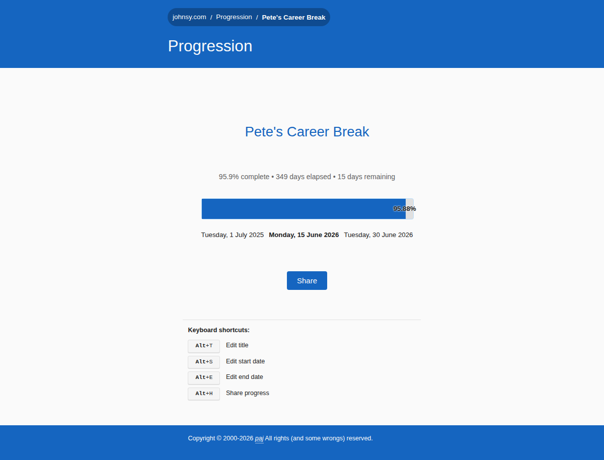

# Progress

A temporal progress bar driven by two dates in the URL path.

[](https://github.com/johnsyweb/progression/actions/workflows/cicd.yml)

Shareable timelines for career breaks, years, or any date range — edit the title and dates in the page, then share a link (and optional PNG) that shows how far through you are. Live at [www.johnsy.com/progression](https://www.johnsy.com/progression/).

## Getting started

Open a range on the live site:

```
https://www.johnsy.com/progression/2024-01-01/2024-12-31
https://www.johnsy.com/progression/2024-01-01/2024-12-31/Pete's Career break
```

- The left end is the earlier date; the right end is the later date
- Within the range, the bar shows percentage complete (clamped 0–100%)
- An optional third path segment is the title (default `"Progress"`)
- With no valid dates, the site redirects to the current calendar year

### Editing and sharing

- **Title** — click or `Alt+T` / `Cmd+T`; Enter saves, Escape cancels
- **Start / end** — click or `Alt+S` / `Cmd+S` and `Alt+E` / `Cmd+E` for date pickers
- **Share** — `Alt+H` / `Cmd+H` uses the Web Share API when available, otherwise copies the link; share can include a PNG of the bar (excluding the Share control)

Light and dark modes follow system preference; colours match www.johnsy.com.



## Help

[GitHub Issues](https://github.com/johnsyweb/progression/issues) — see [docs/agents/issue-tracker.md](docs/agents/issue-tracker.md).

## Maintainers

Pete Johns ([johnsyweb](https://github.com/johnsyweb)).

## Development status

Maintained. Version `1.0.0` in `package.json`; deployed continuously to GitHub Pages.

## Local development

Uses [mise](https://mise.jdx.dev/) for tools and [aube](https://aube.jdx.dev/) for packages (paranoid mode; ADRs in [`docs/adr/`](docs/adr/)).

```bash
mise run bootstrap          # tools + frozen install
mise run update             # after git pull
mise run update-deps        # within-range bumps (aube outdated / update)
aube run dev                # local server
mise run cibuild            # install, lint, typecheck, test, audit, build
aube run build && aube run lighthouse
aube run build && aube run preview &
sleep 5 && aube run generate:screenshot
aube run generate:icons
```

Dependency updates are owned by [Mend Renovate](https://docs.renovatebot.com/) via [johnsyweb/renovate-config](https://github.com/johnsyweb/renovate-config) (seven-day cooling, automerge when CI is green; `aube-lock` regenerates `aube-lock.yaml` on Renovate branches). See [docs/adr/0002-renovate-for-dependency-updates.md](docs/adr/0002-renovate-for-dependency-updates.md).

Tests use Vitest (`aube run test:run` or `aube test`). Layout under `src/` is the Vite app entry, progress bar, date/status helpers, and build plugins.

## Contributing

Issues and PRs against this repository. Pre-commit / pre-push hooks (Husky) run format, lint, typecheck, build, tests, and Lighthouse. Required checks on `main` are applied with:

```bash
aube run setup:branch-protection
# or: bash scripts/apply-branch-protection.sh owner/repo main
```

That enables repository auto-merge and a ruleset requiring `build`, `lint-test`, and `lighthouse`. Strict “branch up to date with `main`” is off so auto-merge is not stuck waiting for Update branch. Re-run the script after changing it.

## Releasing

Merges to `main` run [CI/CD](.github/workflows/cicd.yml): lint, test, Lighthouse, then deploy to GitHub Pages. Repository Settings → Pages → Source must be **GitHub Actions**. Site: `https://www.johnsy.com/progression/` (or `https://<user>.github.io/progression` for a fork).

If CI reports screenshot drift, regenerate with `aube run generate:screenshot` and commit `assets/screenshot.png`. The scheduled screenshot auto-update workflow is disabled; it can still be run manually via Actions.

## SEO and home screen

Open Graph tags, JSON-LD, canonical URLs, and a build-time `sitemap.xml` support sharing. Home-screen icons come from `assets/icon.svg` (PNGs via `aube run generate:icons`) and `manifest.webmanifest` emitted at build time.
